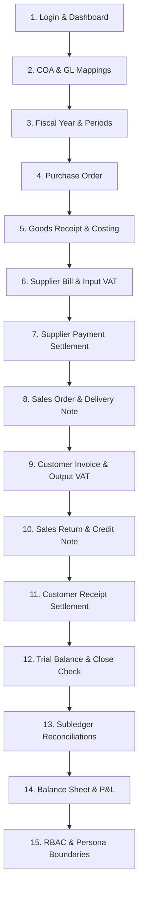

# Mini ERP - Owner & Accountant Acceptance Execution Script
# دليل وخطوات التنفيذ العملي للقبول النهائي (لأصحاب الأعمال والمحاسبين)

**Document Version:** 1.0  
**Phase:** Phase 19 Slice 3  
**Status:** READY FOR OPERATIONAL ACCEPTANCE  
**Target Audience:** Business Owner, Financial Controller, Head Accountant, Internal Auditor  
**System Architecture:** Single-Installation Commercial ERP (No Multi-Tenancy)  
**Supported Locales:** Arabic (`ar`) / English (`en`)  

---

## 1. Purpose & Overview / الهدف ونظرة عامة

This execution script is a compact, non-technical walkthrough guide designed for business owners and head accountants to conduct structured, end-to-end acceptance testing of Mini ERP.

By following these 15 sequential steps, the business owner and financial team can verify operational workflows (Procure-to-Pay, Order-to-Cash, Returns, Treasury), double-entry accounting integrity, tax compliance (14% VAT), role-based security, and financial statement accuracy before granting operational sign-off.

---

## 2. Pre-Session Setup & Seeding / الإعداد المسبق وبيانات الاختبار

Before starting the acceptance session, run the automated accountant acceptance seeder in your local or staging environment:

```powershell
# From the laravel directory:
php artisan db:seed --class=AccountantAcceptanceSeeder
```

### What this seeder configures:
- **Base Currency:** Egyptian Pound (EGP).
- **Chart of Accounts:** Standard commercial COA with leaf posting accounts (GL `1100` Cash, `1110` Bank, `1200` AR Control, `1300` Input Tax, `1400` Inventory Asset, `2100` AP Control, `2200` Output Tax, `2300` GRNI Clearing, `4100` Sales Revenue, `4200` Sales Returns, `5500` COGS).
- **Fiscal Year & Periods:** Open current calendar year with 12 open monthly financial periods.
- **Operational Dimensions:** 2 Branches (`ACC-HO` Head Office, `ACC-ALX` Alexandria), 2 Warehouses (`ACC-WH-MAIN`, `ACC-WH-ALX`), 1 Project (`ACC-PRJ-01`), 1 Cost Center (`ACC-CC-01`), 1 Budget (`ACC-BDG-2026`).
- **Master Data:** 1 Customer (`ACC-CUST-001`), 1 Supplier (`ACC-SUPP-001`), 3 Products (`ACC-PRD-STOCK-01` Stocked item @ 100 cost / 150 price, `ACC-PRD-SERV-01` Service item, `ACC-PRD-NONSTOCK-01` Consumable).
- **Tax Setup:** 14% Standard VAT (`VAT_STD_14`).

---

## 3. Personas & Login Roles / المستخدمون والأدوار

During the acceptance walkthrough, the tester will switch between these realistic operational personas:

| Persona / Role | Intended User | Scope of Access | Testing Goal |
|---|---|---|---|
| **Super Admin / ERP Admin** | Business Owner / System Admin | Full access to all modules, settings, user management, and approval rules. | Master configuration, security audit, complete oversight. |
| **Lead Accountant (`ACCOUNTANT`)** | Financial Controller / Head Accountant | GL, Journal, Ledger, Trial Balance, AR/AP, Treasury, Fixed Assets, Expenses, Taxes, Reports. | Verify double-entry posting, financial statements, and tax reconciliations. |
| **Sales Executive (`SALES`)** | Sales Team / Cashier | Customer master, Sales Orders, Delivery Notes, Invoices, Returns, Credit Notes. | Verify Order-to-Cash without access to HR or Settings. |
| **Purchasing Officer (`PURCHASING`)** | Purchasing Department | Supplier master, Purchase Orders, Goods Receipts, Supplier Bills, Adjustment Notes. | Verify Procure-to-Pay without access to Payroll or Settings. |
| **Warehouse Supervisor (`INVENTORY`)** | Stock Controller | Warehouses, Stock Balances, Stock Transfers, Stock Counts, Adjustments. | Verify inventory tracking, fulfillment, and restock. |
| **Auditor / Read-Only (`AUDITOR`)** | Internal / External Auditor | View-all access across reports, GL ledger, audit trail, but zero mutating post/create rights. | Verify read-only governance and audit logs. |

---

## 4. Step-by-Step Acceptance Walkthrough (15 Steps) / خطوات الاختبار العملي



### Step 1: Login & Executive Dashboard Verification
- **Login As:** `SUPER_ADMIN` or `ACCOUNTANT`.
- **Navigate To:** `/dashboard`.
- **Expected Result:**
  - Executive KPI summary displays active account counts, posted journals, ledger entries, and unread notifications.
  - Locale toggle switches between English and Arabic seamlessly.

### Step 2: Chart of Accounts & GL Mapping Review
- **Navigate To:** `/accounting/coa` and `/accounting/account-mappings`.
- **Expected Result:**
  - Account tree renders standard categories (Assets, Liabilities, Equity, Revenue, Expenses).
  - Default GL accounts are mapped (AR Control `1200`, AP Control `2100`, GRNI Clearing `2300`, Inventory Asset `1400`, COGS `5500`, VAT Input `1300`, VAT Output `2200`).

### Step 3: Fiscal Year & Financial Periods Check
- **Navigate To:** `/accounting/periods`.
- **Expected Result:**
  - Current fiscal year displays status `open`.
  - Monthly periods are visible with status `open` and Close Readiness check available.

### Step 4: Purchase Order Creation & Confirmation (Procure-to-Pay)
- **Login As:** `PURCHASING` or `ACCOUNTANT`.
- **Navigate To:** `/purchasing/orders`.
- **Action:** Create a Purchase Order for Supplier `ACC-SUPP-001`, Product `ACC-PRD-STOCK-01`, Quantity `100`, Unit Price `100.00 EGP` (Subtotal `10,000.00 EGP`, VAT `1,400.00 EGP`, Total `11,400.00 EGP`).
- **Submit and Confirm:** PO moves to `confirmed` status.

### Step 5: Goods Receipt Note & Inventory Valuation (WAC Costing)
- **Navigate To:** `/purchasing/goods-receipts`.
- **Action:** Create and confirm a Goods Receipt Note referencing the confirmed PO for `100` units into warehouse `ACC-WH-MAIN`.
- **Expected Result:**
  - Stock on hand increases by `100` units at unit cost `100.00 EGP`.
  - System generates posted Journal Entry: `Dr 1400 (Inventory Asset) 10,000.00 / Cr 2300 (GRNI Clearing) 10,000.00`.

### Step 6: Supplier Bill Recording & 14% VAT Input
- **Navigate To:** `/purchasing/bills`.
- **Action:** Create and post a Supplier Bill matching the Goods Receipt Note (`10,000.00 EGP` + `1,400.00 EGP` 14% VAT = `11,400.00 EGP`).
- **Expected Result:**
  - Bill status changes to `posted` and payable entry is recorded in AP subledger.
  - System generates posted Journal Entry: `Dr 2300 (GRNI) 10,000.00 / Dr 1300 (Input Tax) 1,400.00 / Cr 2100 (AP Control) 11,400.00`.

### Step 7: Supplier Payment & AP Settlement
- **Navigate To:** `/supplier-payments`.
- **Action:** Record and post a Bank Payment of `11,400.00 EGP` to `ACC-SUPP-001` from Bank Account `ACC-BANK-01`, allocating full amount against the open bill.
- **Expected Result:**
  - Open AP balance on the bill becomes `0.00 EGP`.
  - System generates posted Journal Entry: `Dr 2100 (AP Control) 11,400.00 / Cr 1110 (Bank Account GL) 11,400.00`.

### Step 8: Sales Order & Delivery Note Stock Fulfillment (Order-to-Cash)
- **Login As:** `SALES` or `ACCOUNTANT`.
- **Navigate To:** `/sales/orders` and create a Sales Order for Customer `ACC-CUST-001`, Product `ACC-PRD-STOCK-01`, Quantity `40`, Unit Price `150.00 EGP` (Subtotal `6,000.00 EGP`, VAT `840.00 EGP`, Total `6,840.00 EGP`). Confirm SO.
- **Navigate To:** `/sales/delivery-notes` and confirm Delivery Note for `40` units from `ACC-WH-MAIN`.
- **Expected Result:**
  - Stock on hand decrements from `100` to `60` units.
  - System generates posted COGS Journal Entry: `Dr 5500 (COGS) 4,000.00 / Cr 1400 (Inventory Asset) 4,000.00` (40 units @ 100.00 cost).

### Step 9: Customer Tax Invoice Posting & 14% VAT Output
- **Navigate To:** `/sales/invoices`.
- **Action:** Create and post Customer Invoice matching the delivery (`6,000.00 EGP` + `840.00 EGP` VAT = `6,840.00 EGP`).
- **Expected Result:**
  - Invoice status changes to `posted` and receivable entry is recorded in AR subledger.
  - System generates posted Journal Entry: `Dr 1200 (AR Control) 6,840.00 / Cr 4100 (Sales Revenue) 6,000.00 / Cr 2200 (Output Tax) 840.00`.

### Step 10: Sales Return & Customer Credit Note Adjustment
- **Navigate To:** `/sales/returns` and record customer return of `10` units against the invoice. Post return.
  - **Result:** Stock restocked (+10 units = 70 units on hand). Posted Journal: `Dr 1400 (Inventory Asset) 1,000.00 / Cr 5500 (COGS) 1,000.00`.
- **Navigate To:** `/sales/credit-notes` and post Credit Note for `10` units @ `150.00` (`1,500.00 EGP` + `210.00 EGP` VAT = `1,710.00 EGP`).
  - **Result:** Posted Journal: `Dr 4200 (Sales Returns) 1,500.00 / Dr 2200 (Output Tax) 210.00 / Cr 1200 (AR Control) 1,710.00`.
  - **Result:** Settle credit note against invoice; remaining customer invoice balance reduces to `5,130.00 EGP`.

### Step 11: Customer Receipt Collection & AR Settlement
- **Navigate To:** `/customer-receipts`.
- **Action:** Record and post a Customer Receipt of `5,130.00 EGP` into Bank Account `ACC-BANK-01`, allocating against the remaining invoice balance.
- **Expected Result:**
  - Open AR balance on the customer invoice becomes `0.00 EGP`.
  - System generates posted Journal Entry: `Dr 1110 (Bank Account GL) 5,130.00 / Cr 1200 (AR Control) 5,130.00`.

### Step 12: General Ledger Trial Balance & Period Close Readiness
- **Login As:** `ACCOUNTANT`.
- **Navigate To:** `/accounting/trial-balance`.
- **Expected Result:**
  - Trial Balance displays Total Debits strictly equal to Total Credits (`12,900.00 EGP == 12,900.00 EGP`).
  - No imbalance or out-of-balance warnings.
- **Navigate To:** `/accounting/periods/{periodId}/close-readiness`.
  - Readiness check confirms 0 unposted drafts or unapproved transactions blocking close.

### Step 13: Subledger to General Ledger Reconciliations
- **Navigate To:**
  - `/reports/ar-gl-reconciliation`: Discrepancy is strictly `0.00 EGP`.
  - `/reports/ap-gl-reconciliation`: Discrepancy is strictly `0.00 EGP`.
  - `/reports/vat-gl-reconciliation`: Input/Output Tax registers reconcile with GL Accounts `1300` and `2200` with `0.00 EGP` difference.

### Step 14: Financial Statements Generation (Balance Sheet & Income Statement)
- **Navigate To:** `/reports/balance-sheet`.
  - **Expected Result:** `Total Assets (2,130.00 EGP) == Total Liabilities & Equity (2,130.00 EGP)`. Imbalance is strictly `0.00 EGP`.
- **Navigate To:** `/reports/income-statement`.
  - **Expected Result:** Revenue (`6,000.00`) - Sales Returns (`1,500.00`) - Net COGS (`3,000.00`) = Net Profit `1,500.00 EGP`. Matches General Ledger.

### Step 15: Role-Based Access Control (RBAC) Boundary Validation
- **Login As:** `SALES` persona user.
  - Attempt accessing `/payroll/runs` or `/settings/company` -> **Must receive `403 Forbidden`**.
- **Login As:** `PURCHASING` persona user.
  - Attempt accessing `/payroll/runs` or `/sales/orders` -> **Must receive `403 Forbidden`**.
- **Login As:** `AUDITOR` persona user.
  - Attempt creating a manual journal via `POST /accounting/journal` -> **Must receive `403 Forbidden`**.
- **Unauthenticated (Guest):**
  - Attempt accessing `/dashboard` or `/reports` -> **Must redirect to `/login`**.

---

## 5. Evidence to Capture for Sign-Off / الأدلة المطلوبة للاعتماد

For formal sign-off, take screenshots or CSV exports of the following key evidence:

1. **Trial Balance Summary:** Showing Total Debits == Total Credits with date/period header.
2. **Balance Sheet:** Showing Total Assets == Total Liabilities + Equity with 0 imbalance.
3. **Income Statement (P&L):** Showing Gross Profit and Net Operating Income.
4. **VAT Reconciliation Report:** Showing Output VAT, Input VAT, and zero reconciliation difference.
5. **AR & AP Subledger Reconciliations:** Showing zero difference between subledger balances and GL control accounts.
6. **Stock Valuation Balance:** Showing ending quantity on hand (`70` units) and moving average cost (`100.00 EGP`).
7. **Security / Audit Log Page:** Showing activity entries recorded for posted transactions.

---

## 6. Issue Classification Guidelines / تصنيف المشكلات

During acceptance testing, classify any observed issues according to these criteria:

### What IS a Blocking Issue (Deal-Breaker / خلل حرج يمنع الاعتماد):
- General Ledger Trial Balance or Balance Sheet is out of balance (Debits != Credits, Imbalance != 0).
- Unhandled `500 Internal Server Error` on standard operational workflows.
- Idempotency failure: re-submitting or re-posting creates duplicate journals or ledger entries.
- Unauthorized privilege escalation: a non-admin role gaining write/delete access to payroll, settings, or closed periods.
- Guest user bypassing login and accessing protected business routes.
- Inventory costing mathematical error (e.g. negative cost or broken moving weighted average).
- Tax calculation mismatch on invoices or bills.

### What is NOT a Blocking Issue (Minor / ملاحظات غير حرجة):
- Minor UI visual styling, padding, or badge alignment nuances.
- Localization wording preference where the financial or operational meaning is already unambiguous.
- Optional CSV export column order suggestions.
- Simulated external hardware behaviors (e.g. physical receipt printer connection in local testing).

---

## 7. Production Operating Safeguards / محاذير التشغيل في بيئة الإنتاج

> [!CAUTION]
> **Strict Restrictions for Production Environments:**
> 1. **Do NOT run demo seeders in production:** `AccountantAcceptanceSeeder` is strictly for local, test, and staging validation.
> 2. **Do NOT execute destructive database commands:** Never run `migrate:fresh`, `db:wipe`, or table truncation on production data.
> 3. **Controlled Period Reopening:** Reopening closed financial periods in production requires explicit executive operator approval and formal audit justification.
> 4. **Live Integrations:** Do not test live banking gateways or official tax authority e-invoicing endpoints with mock test data.

---

## 8. Owner & Accountant Sign-Off Form / نموذج التوقيع والاعتماد

| Verification Milestone | Responsible Role | Pass / Fail | Sign-Off Date | Notes |
|---|---|---|---|---|
| Procure-to-Pay & Stock Valuation | Purchasing / Stock Controller | `[ ] PASS` | `YYYY-MM-DD` | |
| Order-to-Cash, Returns & AR Settlement | Sales Manager / AR Accountant | `[ ] PASS` | `YYYY-MM-DD` | |
| General Ledger, VAT & Financial Statements | Head Accountant / Controller | `[ ] PASS` | `YYYY-MM-DD` | |
| Role Boundaries & Security Hardening | Internal Auditor / IT Lead | `[ ] PASS` | `YYYY-MM-DD` | |
| **FINAL PRODUCT ACCEPTANCE SIGN-OFF** | **Business Owner / Managing Director** | `[ ] APPROVED` | `YYYY-MM-DD` | |

---
