# دليل تشغيل نظام Mini ERP ومخططات التدفق

الإصدار: 2.1 - ٢٠ سبتمبر ٢٠٢٦

> هذا الدليل مطابق لأسماء القائمة الجانبية والإجراءات الحالية. اتبع أسماء المجموعات والشاشات كما تظهر للمستخدم، ولا تستخدم مسارات تقنية في الشرح.

## خريطة القائمة الجانبية

### الوحدات والإدارة ← النظام المحاسبي الرئيسي

- دليل الحسابات
- تصنيفات الحسابات
- أنواع الحسابات
- ربط القوائم المالية
- مابنج حسابات الترحيل
- دفتر اليومية العامة
- دفتر الأستاذ العام
- ميزان المراجعة
- الفترات المالية
- الأرصدة الافتتاحية
- أسعار الصرف
- العملات والنظام النقدي
- أكواد الضرائب
- نسب الضرائب
- الفترات الضريبية

### الوحدات والإدارة ← العملاء والقبض

- العملاء
- أرصدة افتتاحية عملاء
- سندات القبض
- تسوية المستحقات

### الوحدات والإدارة ← الموردين والصرف

- الموردين
- أرصدة افتتاحية موردين
- سندات الصرف
- تسوية المستحقات

### الوحدات والإدارة ← المصروفات

- المصروفات
- فئات المصروفات
- المصروفات المقدمة
- المصروفات المستحقة

### الوحدات والإدارة ← المرتبات

- كشوف المرتبات
- الموظفون
- مكونات المرتب

### الوحدات والإدارة ← الإيجارات

- عقود الإيجار
- فواتير الإيجار
- تسليمات الإيجار
- مرتجعات الإيجار
- عناصر الإيجار

### الوحدات والإدارة ← النقدية والبنوك

- حسابات الخزينة
- حسابات البنوك
- تحويلات الخزينة والبنك
- الشيكات الواردة
- الشيكات الصادرة
- تسوية البنك

### الوحدات والإدارة ← الكتالوج

- المنتجات والخدمات
- تصنيفات المنتجات
- وحدات القياس

### الوحدات والإدارة ← المبيعات

- أوامر البيع
- أذون التسليم
- فواتير العملاء
- مرتجعات البيع
- إشعارات دائنة
- مراجعات الفواتير

### الوحدات والإدارة ← المشتريات

- أوامر الشراء
- أذون الاستلام
- تكاليف الوصول
- فواتير الموردين
- مرتجعات الشراء
- مذكرات التسوية

### الوحدات والإدارة ← عمليات المخزون

- المخازن
- تحويلات المخزون
- جرد المخزون
- تسويات المخزون
- أرصدة المخزون

### الوحدات والإدارة ← الأصول الثابتة

- الأصول الثابتة
- فئات الأصول الثابتة
- مواقع الأصول الثابتة
- جولات الإهلاك
- استبعادات الأصول

### الوحدات والإدارة ← المشاريع ومراكز التكلفة

- المشاريع
- مراكز التكلفة
- الموازنات التقديرية
- الموازنة مقابل الفعلي

### الوحدات والإدارة ← التقارير الفرعية

- مركز التقارير
- كشف حساب عميل
- كشف حساب مورد
- أعمار ديون العملاء
- أعمار ديون الموردين
- دفتر الخزينة
- دفتر البنك
- سجل الشيكات
- تقرير تسوية البنك
- مطابقة العملاء بالأستاذ
- مطابقة الموردين بالأستاذ
- تشغيل الفروع
- ربحية الفروع
- تشغيل الإيجارات
- الميزانية العمومية
- قائمة الدخل
- قائمة التدفقات النقدية
- النسب المالية

### الوحدات والإدارة ← الإدارة والتهيئة

- بيانات الشركة
- الفروع
- الترقيم
- قواعد اعتماد الفروع
- المستخدمون
- سجل التدقيق

## حالات المستندات الفعلية

| نوع المستند | تسلسل الحالة |
|---|---|
| أوامر البيع والشراء | مسودة ← مقدمة ← مؤكدة |
| أذون التسليم والاستلام | مسودة ← مؤكدة |
| الفواتير والتكاليف والمرتجعات | مسودة ← مقدمة ← معتمدة ← مرحلة |
| سندات القبض والصرف | مسودة ← مرحلة |
| تحويل المخزون | مسودة ← مقدمة ← معتمدة ← مصدرة ← مستلمة جزئيًا أو مستلمة |
| عقد الإيجار | مسودة ← مقدمة ← معتمدة ← نشطة ← مكتملة |
| رجوع الإيجار | مسودة ← مقدمة ← مكتملة |
| تسوية البنك | مسودة ← منتهية |
| الفترة الضريبية | مفتوحة ← مسودة إقرار ← مقدمة |

## 1. التهيئة لأول مرة

**مكانها في النظام:** الوحدات والإدارة ← الإدارة والتهيئة، ثم النظام المحاسبي الرئيسي

```mermaid
flowchart RL
    n1["بيانات الشركة والفروع"]
    n2["المستخدمون والصلاحيات"]
    n3["الترقيم وقواعد الاعتماد"]
    n4["العملات والفترات"]
    n5["أنواع وتصنيفات الحسابات"]
    n6["دليل الحسابات"]
    n7["ربط حسابات الترحيل"]
    n8["الضرائب والمخازن"]
    n9["العملاء والموردون والمنتجات"]
    n10["الأرصدة الافتتاحية"]
    n1 --> n2
    n2 --> n3
    n3 --> n4
    n4 --> n5
    n5 --> n6
    n6 --> n7
    n7 --> n8
    n8 --> n9
    n9 --> n10
```



### خطوات التنفيذ

1. ابدأ بالشركة والفرع والعملة الأساسية قبل إدخال أي مستند.
2. أنشئ المستخدمين واربط الصلاحيات بما يفعلونه فعليًا.
3. أكمل دليل الحسابات وربط حسابات الترحيل قبل أول فاتورة أو سند.
4. أنشئ فترة مالية مفتوحة ثم راجع توازن الأرصدة الافتتاحية قبل ترحيلها.

### الضوابط والنتيجة المتوقعة

- لا يمكن الترحيل داخل فترة مالية مغلقة.
- الصلاحية هي التي تحدد ظهور المجموعة أو الزر.
- لا تبدأ التشغيل قبل نجاح ربط العملاء والموردين والمخزون والضرائب.

## 2. الاستخدام اليومي لأي شاشة

**مكانها في النظام:** افتح المجموعة من القائمة الجانبية ثم اختر اسم الشاشة


### خطوات التنفيذ

1. استخدم أسماء القوائم الظاهرة؛ لا يحتاج المستخدم إلى كتابة مسار تقني.
2. الأزرار المعروضة تتغير حسب حالة السجل وصلاحية المستخدم.
3. راجع العملة والتاريخ والفرع والمخزن قبل التأكيد أو الترحيل.
4. بعد الترحيل راجع المستند المصدر والتقرير المرتبط.

### الضوابط والنتيجة المتوقعة

- المسودة قابلة للتعديل عادةً.
- التأكيد قد ينشئ أثر مخزون مباشر.
- الترحيل ينشئ الأثر المالي النهائي ويتطلب فترة مفتوحة.

## 3. القيود اليومية والفترات المالية

**مكانها في النظام:** الوحدات والإدارة ← النظام المحاسبي الرئيسي ← دفتر اليومية العامة


### خطوات التنفيذ

1. اختر التاريخ والوصف والفرع ثم أضف سطور القيد.
2. يجب أن يساوي إجمالي المدين إجمالي الدائن.
3. بعد الاعتماد استخدم ترحيل لإظهار الحركة في دفتر الأستاذ.
4. لتصحيح قيد مرحل استخدم العكس بدل تعديل القيد الأصلي.

### الضوابط والنتيجة المتوقعة

- الحالات: مسودة ← مقدمة ← معتمدة ← مرحلة.
- إغلاق الفترة من شاشة الفترات المالية بعد فحص الجاهزية.
- إعادة فتح الفترة تحتاج صلاحية مستقلة وتأكيدًا حساسًا.

## 4. دورة البيع من الأمر إلى التحصيل

**مكانها في النظام:** الوحدات والإدارة ← المبيعات، ثم العملاء والقبض


### خطوات التنفيذ

1. أنشئ أمر البيع وحدد العميل والعملة والبنود ثم احفظه.
2. قدّم الأمر ثم أكده؛ لا يقبل إذن التسليم إلا أمرًا مؤكدًا.
3. أنشئ إذن التسليم وحدد المخزن والكميات الفعلية ثم اضغط تأكيد.
4. أنشئ الفاتورة من الأمر أو إذن التسليم، ثم قدّمها واعتمدها ورحّلها.
5. أنشئ سند القبض ورحّله، ثم افتح تسوية المستحقات واربط المبلغ بالفاتورة.

### الضوابط والنتيجة المتوقعة

- أمر البيع: مسودة ← مقدم ← مؤكد.
- إذن التسليم: مسودة ← مؤكد، والتأكيد يسجل خروج المخزون.
- الفاتورة: مسودة ← مقدمة ← معتمدة ← مرحلة.
- سند القبض: مسودة ← مرحل؛ التسوية خطوة مستقلة عن الترحيل.

## 5. تصحيح المبيعات

**مكانها في النظام:** الوحدات والإدارة ← المبيعات ← مرتجعات البيع أو إشعارات دائنة


### خطوات التنفيذ

1. استخدم مرتجع البيع عندما تعود كمية من إذن تسليم مؤكد.
2. حدد طريقة التصرف: إعادة للمخزون أو إتلاف.
3. استخدم الإشعار الدائن لتخفيض رصيد العميل.
4. تظهر النسخة المصححة داخل مراجعات الفواتير بعد ترحيل التصحيح.

### الضوابط والنتيجة المتوقعة

- لا تعدّل فاتورة مرحلة مباشرة.
- المرتجع والإشعار يمران بمسودة ثم تقديم واعتماد وترحيل.
- تسوية الإشعار تختلف عن تسوية سند القبض.

## 6. دورة الشراء من الأمر إلى السداد

**مكانها في النظام:** الوحدات والإدارة ← المشتريات، ثم الموردين والصرف


### خطوات التنفيذ

1. أنشئ أمر الشراء وحدد المورد والبنود ثم قدّمه وأكده.
2. أنشئ إذن الاستلام من أمر مؤكد، وسجل المخزن والكميات الفعلية، ثم أكد الإذن.
3. إذا وجدت شحن أو تأمين أو رسوم، أنشئ تكلفة وصول ووزعها بالكامل ثم قدّمها واعتمدها ورحّلها.
4. أنشئ فاتورة المورد ثم قدّمها واعتمدها ورحّلها.
5. أنشئ سند الصرف ورحّله، ثم افتح تسوية المستحقات واربط الدفعة بالفاتورة.

### الضوابط والنتيجة المتوقعة

- إذن الاستلام لا يملك زر ترحيل مستقل؛ التأكيد يسجل دخول المخزون.
- تكلفة الوصول: مسودة ← مقدمة ← معتمدة ← مرحلة.
- فاتورة المورد: مسودة ← مقدمة ← معتمدة ← مرحلة.
- سند الصرف: مسودة ← مرحل؛ التسوية خطوة مستقلة.

## 7. تصحيح المشتريات

**مكانها في النظام:** الوحدات والإدارة ← المشتريات ← مرتجعات الشراء أو مذكرات التسوية


### خطوات التنفيذ

1. أنشئ مرتجع الشراء من إذن استلام مؤكد.
2. حدد الكمية المرتجعة والمخزن والسبب.
3. استخدم مذكرة التسوية لتصحيح رصيد المورد المرتبط بفاتورة.
4. راجع كشف المورد ومطابقة الموردين بالأستاذ بعد الترحيل والتسوية.

### الضوابط والنتيجة المتوقعة

- لا تعدّل فاتورة مورد مرحلة مباشرة.
- المرتجع والمذكرة يمران بمسودة ثم تقديم واعتماد وترحيل.
- كل عملية تصحيح تحتفظ برابط إلى مستندها المصدر.

## 8. القبض والصرف وتسوية المستحقات

**مكانها في النظام:** الوحدات والإدارة ← العملاء والقبض أو الموردين والصرف

```mermaid
flowchart RL
    n1["اختيار العميل أو المورد"]
    n2["إنشاء سند قبض أو صرف"]
    n3["مراجعة الحساب والعملة"]
    n4["ترحيل السند"]
    n5["ظهور رصيد غير مسوى"]
    n6["فتح تسوية المستحقات"]
    n7["اختيار الفواتير"]
    n8["إدخال مبالغ التسوية"]
    n9["تنفيذ التسوية"]
    n10["عكس التسوية عند الخطأ"]
    n1 --> n2
    n2 --> n3
    n3 --> n4
    n4 --> n5
    n5 --> n6
    n6 --> n7
    n7 --> n8
    n8 --> n9
    n9 --> n10
```



### خطوات التنفيذ

1. يجب أن تتطابق عملة السند مع عملة المستحقات المختارة.
2. لا تتجاوز المبلغ المتاح في السند ولا الرصيد المفتوح للفاتورة.
3. يمكن تنفيذ تسوية جزئية ثم استكمال الباقي لاحقًا.
4. استخدم إلغاء التسوية لإعادة فتح الرصيد دون عكس السند نفسه.

### الضوابط والنتيجة المتوقعة

- ترحيل السند ينشئ الحركة المالية.
- تسوية المستحقات تربط الحركة بالمستند المفتوح.
- راجع كشف الحساب وأعمار الديون بعد التنفيذ.

## 9. تحويلات المخزون

**مكانها في النظام:** الوحدات والإدارة ← عمليات المخزون ← تحويلات المخزون


### خطوات التنفيذ

1. يجب أن يختلف مخزن المصدر عن مخزن الوجهة.
2. راجع الرصيد المتاح قبل الإصدار.
3. يمكن للوجهة استلام جزء من الكمية ثم استلام المتبقي.
4. راجع أرصدة المخزون وحركات الصنف بعد اكتمال التحويل.

### الضوابط والنتيجة المتوقعة

- الحالات: مسودة ← مقدمة ← معتمدة ← مصدرة ← مستلمة جزئيًا ← مستلمة.
- الإصدار يخفض المصدر، والاستلام يزيد الوجهة.
- الإلغاء متاح فقط قبل الأثر غير القابل للإلغاء.

## 10. جرد وتسويات المخزون

**مكانها في النظام:** الوحدات والإدارة ← عمليات المخزون ← جرد المخزون أو تسويات المخزون


### خطوات التنفيذ

1. أدخل الكميات الفعلية فقط بعد تثبيت نطاق الجرد.
2. إذا كانت الفروق غير صحيحة، صحح المسودة وأعد المراجعة.
3. ترحيل الجرد ينشئ حركات وقيد فروق المخزون.
4. استخدم تسويات المخزون للحالات غير الناتجة عن جلسة جرد.

### الضوابط والنتيجة المتوقعة

- الجرد والتسوية: مسودة ← مقدمة ← معتمدة ← مرحلة.
- الترحيل يحتاج صلاحية مخزون مالية وفترة مفتوحة.
- راجع رصيد الصنف وكشف حركة المخزن بعد الترحيل.

## 11. الخزينة والبنوك وتسوية البنك

**مكانها في النظام:** الوحدات والإدارة ← النقدية والبنوك


### خطوات التنفيذ

1. اختر حسابين مختلفين ومتوافقين مع الفرع والعملة.
2. التحويل يبقى مسودة حتى الضغط على ترحيل.
3. داخل تسوية البنك أضف سطور الكشف ثم طابقها مع الحركات المرشحة.
4. لا يتاح إنهاء التسوية إلا عندما تصبح متوازنة بالكامل.

### الضوابط والنتيجة المتوقعة

- تحويل الخزينة والبنك: مسودة ← مرحل.
- تسوية البنك: مسودة ← منتهية.
- راجع دفتر الخزينة أو دفتر البنك وتقرير تسوية البنك.

## 12. الشيكات الواردة والصادرة

**مكانها في النظام:** الوحدات والإدارة ← النقدية والبنوك ← الشيكات الواردة أو الشيكات الصادرة


### خطوات التنفيذ

1. سجل البنك والتاريخ والقيمة ورقم الشيك بدقة.
2. في الشيك الوارد نفذ الاستلام ثم الإيداع قبل التحصيل.
3. في الشيك الصادر راقب حالة التقديم والتحصيل.
4. استخدم سجل الشيكات لمتابعة الحالات والاستحقاقات.

### الضوابط والنتيجة المتوقعة

- كل انتقال حالة يحتاج الصلاحية المقابلة.
- الإرجاع يعالج الأثر حسب اتجاه الشيك.
- لا تستخدم الإلغاء بدل الإرجاع بعد بدء التحصيل.

## 13. المصروف المباشر

**مكانها في النظام:** الوحدات والإدارة ← المصروفات ← المصروفات


### خطوات التنفيذ

1. اختر طريقة التسوية: مورد، خزينة، أو بنك.
2. إذا كانت الطريقة موردًا فحدد المورد؛ وإذا كانت نقدية فحدد الحساب.
3. راجع الفرع والعملة والضريبة والمرفق قبل التقديم.
4. بعد الترحيل راجع دفتر الأستاذ أو رصيد المورد حسب الطريقة.

### الضوابط والنتيجة المتوقعة

- الحالات: مسودة ← مقدمة ← معتمدة ← مرحلة.
- المصروف المباشر شاشة مستقلة عن جداول المقدم والمستحق.
- يمكن إلغاء المستند قبل الترحيل حسب حالته وصلاحيتك.

## 14. المصروفات المقدمة والمستحقة

**مكانها في النظام:** الوحدات والإدارة ← المصروفات ← المصروفات المقدمة أو المصروفات المستحقة


### خطوات التنفيذ

1. المقدم يعترف بالمصروف دوريًا مقابل تخفيض الأصل المقدم.
2. المستحق يثبت مصروف الفترة مقابل التزام مستحق.
3. لا ترحل بند فترة قبل اعتماده أو داخل فترة مغلقة.
4. راجع البنود المرحلة والمتبقية في نفس شاشة الجدول.

### الضوابط والنتيجة المتوقعة

- الجدول: مسودة ← مقدمة ← معتمدة.
- كل قسط أو قيد دوري له إجراء ترحيل مستقل.
- هذه الدورة لا تبدأ من شاشة المصروف المباشر.

## 15. كشوف المرتبات

**مكانها في النظام:** الوحدات والإدارة ← المرتبات ← الموظفون، مكونات المرتب، ثم كشوف المرتبات


### خطوات التنفيذ

1. أكمل بيانات الموظف ومكونات المرتب قبل توليد الكشف.
2. يمكن إعادة توليد السطور أثناء حالة المسودة فقط.
3. راجع صافي المرتب والضرائب والتأمينات قبل التقديم.
4. رحّل الكشف بعد الاعتماد ثم راجع قيد المرتبات.

### الضوابط والنتيجة المتوقعة

- الحالات الحالية: مسودة ← مقدمة ← معتمدة ← مرحلة.
- لا يوجد في الواجهة الحالية زر مستقل لسداد أو إغلاق كشف المرتبات.
- السداد الفعلي يسجل وفق إجراءات الخزينة أو البنك المعتمدة لدى الشركة.

## 16. عقود وتسليم ومرتجعات الإيجار

**مكانها في النظام:** الوحدات والإدارة ← الإيجارات


### خطوات التنفيذ

1. تحقق من توافر العنصر خلال فترة العقد.
2. بعد اعتماد العقد فعّله ثم أنشئ تسليم الإيجار وأكد التسليم.
3. عند الرجوع سجل حالة العنصر والملحقات وتكلفة التلف التقديرية.
4. قدّم الرجوع ثم استخدم إكمال الفحص لتطبيق النتيجة.

### الضوابط والنتيجة المتوقعة

- العقد: مسودة ← مقدمة ← معتمدة ← نشطة ← مكتملة.
- التسليم: مسودة ← مؤكد.
- الرجوع: مسودة ← مقدمة ← مكتملة.
- تأكيد التسليم لا ينشئ فاتورة أو قيدًا محاسبيًا.

## 17. فواتير الإيجار

**مكانها في النظام:** الوحدات والإدارة ← الإيجارات ← فواتير الإيجار


### خطوات التنفيذ

1. يمكن إصدار فاتورة دورية أثناء نشاط العقد؛ لا يلزم انتظار المرتجع.
2. أنواع البنود تشمل الإيجار والتأمين ورسوم التلف والتأخير.
3. راجع البنود غير المفوترة من تقرير تشغيل الإيجارات.
4. بعد الترحيل تظهر الذمة والضريبة والإيراد والقيد المرتبط.

### الضوابط والنتيجة المتوقعة

- الحالات: مسودة ← مقدمة ← معتمدة ← مرحلة.
- التأمين والرسوم يعالجان حسب نوع البند وربط الحسابات.
- استخدم تقرير تشغيل الإيجارات قبل إقفال الشهر.

## 18. الأصول الثابتة والإهلاك والاستبعاد

**مكانها في النظام:** الوحدات والإدارة ← الأصول الثابتة

```mermaid
flowchart RL
    n1["إنشاء الفئة والموقع"]
    n2["إضافة أصل مسودة"]
    n3["رسملة الأصل"]
    n4["توليد جدول الإهلاك"]
    n5["معاينة جولة الإهلاك"]
    n6["ترحيل الجولة"]
    n7["نقل الأصل عند الحاجة"]
    n8["معاينة الاستبعاد"]
    n9["ترحيل الاستبعاد"]
    n10["العكس عند التصحيح"]
    n1 --> n2
    n2 --> n3
    n3 --> n4
    n4 --> n5
    n5 --> n6
    n6 --> n7
    n7 --> n8
    n8 --> n9
    n9 --> n10
```



### خطوات التنفيذ

1. أدخل تاريخ الاقتناء وبدء الخدمة والعمر والقيمة التخريدية.
2. اختر طريقة الرسملة المناسبة: أصل افتتاحي أو رسملة دفترية.
3. عاين جولة الإهلاك للفترة قبل ترحيلها.
4. في الاستبعاد راجع صافي القيمة الدفترية والربح أو الخسارة قبل التنفيذ.

### الضوابط والنتيجة المتوقعة

- الأصل ينشأ مسودة ويصبح نشطًا بعد الرسملة.
- جولة الإهلاك تُرحّل مباشرة بعد المعاينة والتأكيد.
- الرسملة والإهلاك والاستبعاد لها عمليات عكس حساسة.

## 19. الضرائب والقيمة المضافة

**مكانها في النظام:** الوحدات والإدارة ← النظام المحاسبي الرئيسي ← أكواد الضرائب أو نسب الضرائب أو الفترات الضريبية


### خطوات التنفيذ

1. حدد نوع الضريبة وطريقة الاحتساب وقابلية الاسترداد.
2. استخدم تاريخ السريان الصحيح للنسبة.
3. راجع سجل الضريبة وملخص القيمة المضافة والمطابقة قبل تقديم الإقرار.
4. بعد تقديم الفترة يمنع النظام الترحيل داخل نطاقها الضريبي.

### الضوابط والنتيجة المتوقعة

- الفترة الضريبية الحالية: مفتوحة ← مسودة إقرار ← مقدمة.
- لا يوجد في الواجهة الحالية إجراء مستقل لسداد أو إغلاق الفترة الضريبية.
- أي فروق يجب تصحيحها من المستند المصدر قبل تقديم الإقرار.

## 20. المشاريع ومراكز التكلفة والموازنات

**مكانها في النظام:** الوحدات والإدارة ← المشاريع ومراكز التكلفة


### خطوات التنفيذ

1. اربط المشروع أو مركز التكلفة بسطر العملية عند الإدخال.
2. أدخل الموازنة حسب الحساب والفترة والأبعاد المطلوبة.
3. قدّم الموازنة واعتمدها ثم فعّل النسخة المعتمدة.
4. استخدم تقرير الموازنة مقابل الفعلي للتحليل والمتابعة.

### الضوابط والنتيجة المتوقعة

- الموازنة: مسودة ← مقدمة ← معتمدة ← نشطة.
- تفعيل نسخة قد يؤرشف النسخة السابقة وفق الإعداد.
- الأبعاد لا تنشئ قيودًا مستقلة؛ تحمل على القيود المصدرية.

## 21. التقارير والإغلاق الشهري

**مكانها في النظام:** الوحدات والإدارة ← التقارير الفرعية، ثم النظام المحاسبي الرئيسي ← الفترات المالية

```mermaid
flowchart RL
    n1["مراجعة المستندات غير المرحلة"]
    n2["استكمال تسوية المستحقات"]
    n3["إنهاء تسوية البنك"]
    n4["ترحيل الجداول والمرتبات والإهلاك"]
    n5["مراجعة الضرائب"]
    n6["مطابقة العملاء والموردين بالأستاذ"]
    n7["مراجعة ميزان المراجعة"]
    n8["مراجعة القوائم المالية"]
    n9["فحص جاهزية الإغلاق"]
    n10["إغلاق الفترة"]
    n1 --> n2
    n2 --> n3
    n3 --> n4
    n4 --> n5
    n5 --> n6
    n6 --> n7
    n7 --> n8
    n8 --> n9
    n9 --> n10
```

### خطوات التنفيذ

1. ابدأ بكشوف العملاء والموردين وأعمار الديون.
2. راجع دفاتر الخزينة والبنك وسجل الشيكات وحركات المخزون.
3. نفذ مطابقات العملاء والموردين والضريبة مع الأستاذ.
4. افتح الفترات المالية واضغط إغلاق الفترة؛ يعرض النظام موانع الإغلاق أولًا.

### الضوابط والنتيجة المتوقعة

- لا تغلق الفترة قبل معالجة كل موانع الجاهزية.
- بعد الإغلاق تمنع القيود الجديدة داخل الفترة.
- إعادة الفتح تحتاج صلاحية مستقلة وسببًا واضحًا.

## 22. معالجة الأخطاء والصلاحيات

**مكانها في النظام:** من الشاشة الحالية راجع رسالة الخطأ، ثم انتقل إلى شاشة السبب من القائمة الجانبية

```mermaid
flowchart RL
    n1["قراءة رسالة الخطأ"]
    n2["تحديد نوع السبب"]
    n3["صلاحية مفقودة"]
    n4["حالة مستند غير مناسبة"]
    n5["فترة مغلقة"]
    n6["ربط حساب ناقص"]
    n7["عملة أو رصيد أو كمية غير صحيحة"]
    n8["تصحيح المصدر"]
    n9["إعادة الإجراء"]
    n10["مراجعة سجل التدقيق"]
    n1 --> n2
    n2 --> n3
    n3 --> n4
    n4 --> n5
    n5 --> n6
    n6 --> n7
    n7 --> n8
    n8 --> n9
    n9 --> n10
```

### خطوات التنفيذ

1. إذا اختفى زر أو مجموعة، راجع صلاحية المستخدم أولًا.
2. إذا رفض النظام الإجراء، راجع حالة المستند والمتطلبات السابقة.
3. إذا فشل الترحيل، راجع الفترة المالية وربط الحسابات والضريبة.
4. إذا فشلت التسوية، راجع العملة والرصيد غير المسوى والمبلغ المفتوح.

### الضوابط والنتيجة المتوقعة

- لا تتجاوز الضوابط بتعديل البيانات مباشرة.
- استخدم العكس أو المرتجع أو مذكرة التسوية للمستندات المرحلة.
- سجل التدقيق هو المرجع لمعرفة من نفذ الإجراء ومتى.

## قواعد تشغيل ملزمة

1. لا ترحيل داخل فترة مالية مغلقة.
2. لا تعديل مباشر لمستند مرحل؛ استخدم العكس أو المرتجع أو مذكرة التسوية.
3. تأكيد إذن التسليم أو الاستلام هو الذي يسجل حركة المخزون.
4. ترحيل سند القبض أو الصرف يختلف عن تسوية المستحقات.
5. لا تنه تسوية البنك قبل وصول الفرق إلى صفر.
6. لا ترحل تكلفة وصول قبل توزيعها بالكامل وربطها بإذن استلام مؤكد.
7. ظهور الشاشة والزر يعتمد على صلاحيات المستخدم وحالة المستند.
